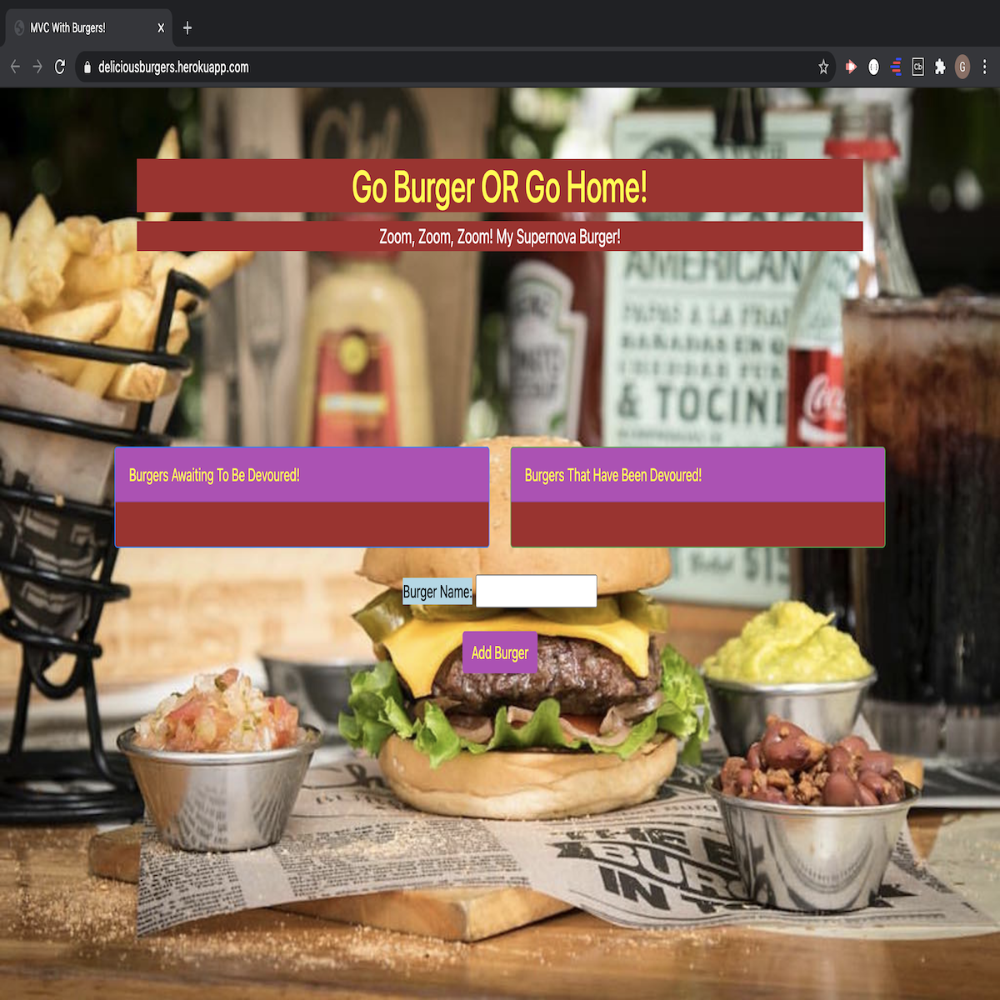
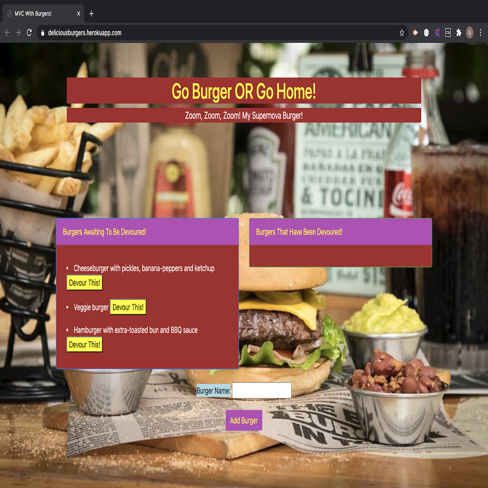
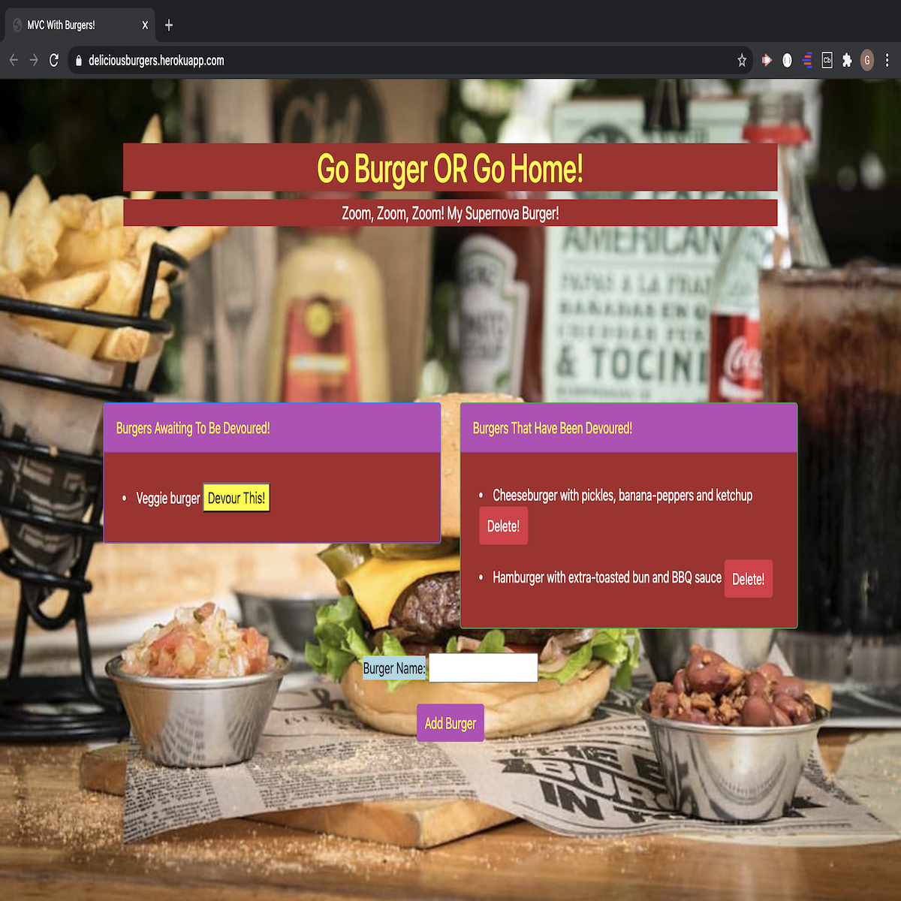
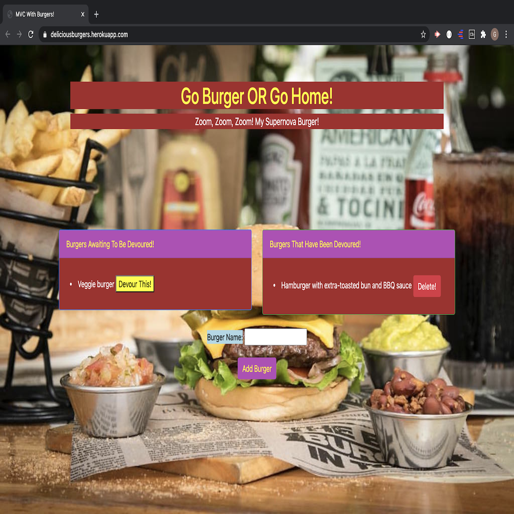

*** Burger App ***

<h1> DESCRIPTION </h1>

This application allows the user to add the hamburgers they desired to devour and delete the input. 

Once the user visits this website, the user is given an location to input a text, preferrably relating to hamburgers. Once the user types the type of burger he/she would like to eat, then the user can press 'enter' on his/her keyboard or click on the 'add burger' button. The input the user type will be displayed on the left side of the page under 'bugers that have been devoured' list. 

The input (considering it is a type of hamburger) will have two buttons next to it. A 'devour this' button and a 'delete' button. If the user wants to eat the hamburger, he/she can click 'devour this' and the hamburger will move to the right side of the page under the "bugers that have been devoured' list, indicating the hamburger was devoured. There will be a 'delete' button next to the devoured burger where the user can click to the delete the devoured burger. 
  

<h2>USAGE</h2>

<h2>Burger-App is using MVC architectural framework</h2>

I created a MySQL database and ran the following files to set up the schema

db/schema.sql
db/seeds.sql

I configured the database connection settings.

I created a jawsDB database using Heroku and deployed this app on Heroku.

This App was designed using the following:
  

<h2>SCREENSHOTS OF APP</h2>

The main page of the app prior to the user typing his/her input of the type of burger the user wants to eat. Below is a screenshot showing how the page would look for a first-time user. 

 
 

Screenshot of the app AFTER the user inputs what type of burger he/she would like to eat. Next to the burger, there are two button. If the user clicks 'devour this', then the burger will move to the right hand side of the page, shown in screenshot image #3.

 
 

This is the result of the user clicking 'devour this' button, indicating that the burger has been devoured. Once the user clicks the 'devour this' button, the burger is automatically moved from the 'burgers awaiting to be devoured' list on the left side to the 'burgers that have been devoured' list on the right side. A 'delete' button is available on both sides if the user chooses to delete at anytime. 

 
 

As demonstrated in this last screenshot of the application, the user can remove the burger that has been clicked to be devoured once it moves to the right side of the page under the "burgers that have been devoured" list.

 

